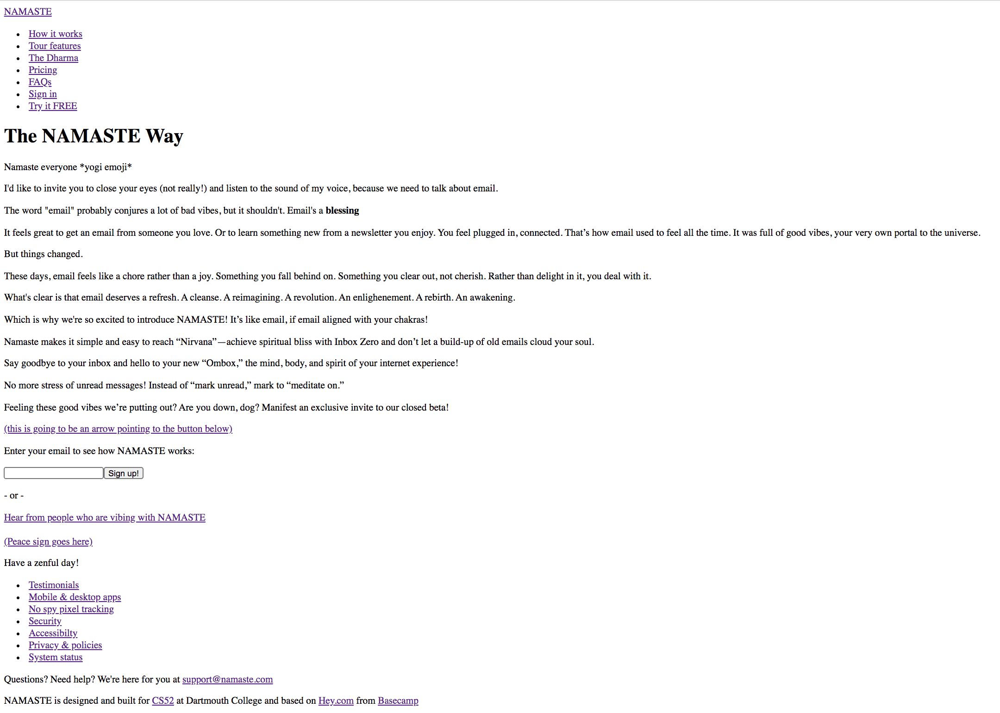

# CS52 Landing Page

## Overview

I based my landing page on the landing page for Hey.com, the new email service from Basecamp. I was inspired by this tweet I saw that parodied the new service:

With that in mind, I built a landing page for an email service called NAMASTE based on the tweet. Most of the elements were the same as or similar to the Hey.com landing page. I changed some of the names in the navbar ("The Dharma" instead of "Manifesto"), and I also rewrote most of the text on the main page, although the structure and some of the phrases are similar. 

I'm really happy with how similar I was able to get the page to look. I think the hover effects and gradient buttons look great, and I especially like the gradient hover effect on the footer links. 

You can find my deployed URL here: 
[deployed url](https://dartmouth-cs52-20x.github.io/lab1-landingpage-jeremy-washam/)

## Reservations

Initially, I planned on using a background image (per the lab requirements), but once I finished building the landing page I really liked the layout with the white background, and all of the images I tried were a lot worse. At the same time, I couldn't find anything to use for the long arrow icon on the original Hey.com page (pointing from the introduction text to the signup link). So I decided to kill two birds with one stone and replace the arrow with an upside silhoutte of a yogi (with hands pointing up in mountain pose). It's quite ridiculous, and the site certainly looks less professional than it did without it, but I thought it was pretty funny and the image resizes nicely when you shrink the page, so I decided to stick with it. 

I also couldn't find a way to keep the navbar at the top of the page like on the Hey.com page. position:fixed seemed to work, but messed up the rest of my layout, and I couldn't find a way to do it while also using flexboxes at the top. I'm sure there's a simple solution here but I couldn't find one.

I didn't love the way the email input turned out either (there wasn't a feature for me to base it off of from the original site, so I come up with the design on my own). I changed the style and added a hover effect, but it still doesn't look as good as the rest of the page in my opinion.

Finally, my css is much messier than I would like. I had almost no experience with css going into this, and I was really learning everything on the fly while I worked on the lab. While I'm happy with how the page looks (and really happy with how much I learned while doing this), I'm sure that if I started the lab right now, it would be a lot cleaner and better organized. 

## Screenshots

Here's the screenshot I took when I finished the HTML layout stage (a lot of my HTML ended up changing when I styled the page).

Next, I've got a screenshot of the top of the page. 

And here's the bottom of the fullscreen page (I really like how the footer links look here).

Finally, here's the top of the mobile version, with the hamburger menu at the top right. 

And here's the column of footer links at the bottom of the mobile version.

